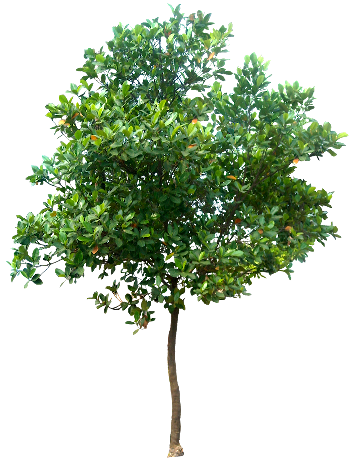
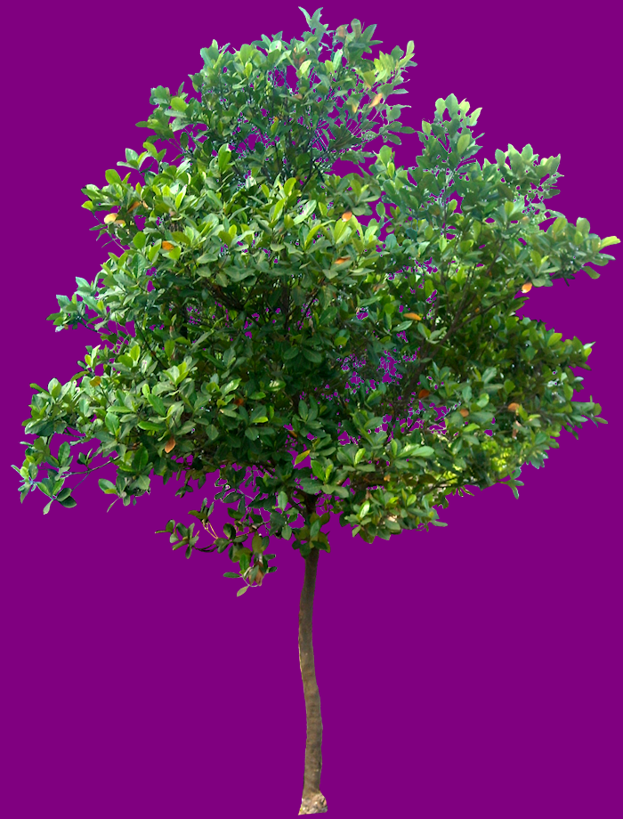
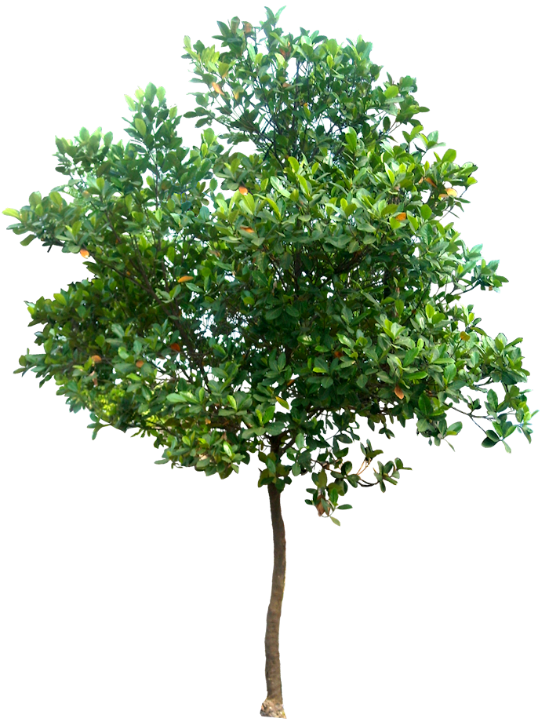

Image
=====

Aplus Framework Image Library.

- `Installation`_
- `Instantiating a new Image`_
- `Getting Image Information`_
- `Setting new Properties`_
- `Image Manipulation`_
- `Rendering Methods`_
- `Conclusion`_

Installation
------------

The installation of this library can be done with Composer:

.. code-block::

    composer require aplus/image

Instantiating a new Image
-------------------------

.. code-block:: php

    <?php
    require __DIR__ . '/vendor/autoload.php';

    use Framework\Image\Image;

    $filename = __DIR__ . '/tree.png';

    $image = new Image($filename);

Detecting if a file is Acceptable
^^^^^^^^^^^^^^^^^^^^^^^^^^^^^^^^^

Indicates if a given file has an acceptable (PNG, JPEG or GIF) image type.

.. code-block:: php

    $isAcceptable = Image::isAcceptable($filename); // bool

Getting Image Information
-------------------------

Get Width
^^^^^^^^^

Gets the image width.

.. code-block:: php

    $width = $image->getWidth(); // int

Get Height
^^^^^^^^^^

Gets the image height.

.. code-block:: php

    $height = $image->getHeight(); // int

Get Resolution
^^^^^^^^^^^^^^

Gets the image resolution.

.. code-block:: php

    $resolution = $image->getResolution(); // int[]

The $resolution value will be an array like the following:

.. code-block:: php

    [
        'horizontal' => 300,
        'vertical' => 300,
    ]

Get Quality
^^^^^^^^^^^

Gets the image quality/compression level.

.. code-block:: php

    $quality = $image->getQuality(); // int|null

- Returns an integer for PNG and JPEG types or null for GIF.

Get MIME Type
^^^^^^^^^^^^^

Gets the image MIME type.

.. code-block:: php

    $mime = $image->getMime(); // string

- Returns a string with the MIME type (e.g. *image/png*).

Get Extension
^^^^^^^^^^^^^

Gets a file extension based in the image type.

.. code-block:: php

    $extension = $image->getExtension(); // string|false

- Returns a string with the extension (e.g. *.png*) or false on fail.

Get GdImage
^^^^^^^^^^^

Gets the image GD instance.

.. code-block:: php

    $gdImage = $image->getInstance(); // GdImage

Setting new Properties
----------------------

Set Quality
^^^^^^^^^^^

Sets the image quality/compression level.

.. code-block:: php

    $image->setQuality(8); // static

- The quality value must not be set on GIF images.
- PNG images must have a value between 0 and 9.
- JPEG images must have a value between 0 and 100.

Set Resolution
^^^^^^^^^^^^^^

Sets the image resolution.

.. code-block:: php

    $horizontal = 96;
    $vertical = 96;
    $image->setResolution($horizontal, $vertical); // static

- The resolution values are in DPI. Default is set 96 to both.

Set GdImage
^^^^^^^^^^^

Sets the image GD instance.

.. code-block:: php

    $gdImage = imagecreatefrompng($filename);
    $image->setInstance($gdImage); // static

Image Manipulation
------------------

The Image class has methods to `Crop`_, `Filter`_, `Flatten`_, `Flip`_, `Rotate`_,
`Scale`_ and add `Watermark`_.

The image below is the original used for our demonstration.
It is a PNG file, with transparent background.

Crop
^^^^

Crops the image.

.. code-block:: php

    $width = 200;
    $height = 200;
    $marginLeft = 100; 
    $marginTop = 100;
    $image->crop($width, $height, $marginLeft, $marginTop); // static

- Argument value sizes are in pixels.
- If a margin is negative or larger than the canvas, it will add extra space to the image size.

The cropped image will be like the following:

.. image:: img/tree-crop.png
    :alt: Aplus Image - Crop

Filter
^^^^^^

Applies a filter to the image.

.. code-block:: php

    $image->filter(IMG_FILTER_NEGATE); // static

- The first param is an
`image filter <https://www.php.net/manual/en/function.imagefilter.php>`_ constant.
- The second param is an *spread* of image filter arguments.

The filtered image will be like the following:

.. image:: img/tree-filter.png
    :alt: Aplus Image - Filter

Flatten
^^^^^^^

Flattens the image.

Replaces transparency with an RGB color.

.. code-block:: php

    $red = 128; 
    $green = 0;
    $blue = 128;
    $image->flatten($red, $green, $blue); // static

The flattened image will be like the following:

Flip
^^^^

Flips the image.

.. code-block:: php

    $direction = 'horizontal';
    $image->flip($direction); // static

The allowed $direction values are:

- ``h`` or ``horizontal`` to horizontal flip.
- ``v`` or ``vertical`` to vertical flip.
- ``b`` or ``both`` to both, horizontal and vertical, flip.

The flipped image will be like the following:

Rotate
^^^^^^

Rotates the image with a given angle.

.. code-block:: php

    $angle = 45;
    $image->rotate($angle); // static

- The rotation angle is in degrees. Clockwise direction.

The rotated image will be like the following:

.. image:: img/tree-rotate.png
    :alt: Aplus Image - Rotate

Scale
^^^^^

Scales the image.

.. code-block:: php

    $width = 80;
    $height = -1;
    $image->scale($width, $height); // static

- Width and height sizes are in *pixels*.
- Height can be ``-1`` to be automatically proportional to the width.

The scaled image will be like the following:

.. image:: img/tree-scale.png
    :alt: Aplus Image - Scale

Watermark
^^^^^^^^^

Adds a watermark to the image.

.. code-block:: php

    $watermark = new Image($filename);
    $watermark->scale(100);
    $horizontalPosition = -10;
    $verticalPosition = -10;
    $image->watermark($watermark, $horizontalPosition, $verticalPosition); // static

- Watermark must be an Image instance.
- Horizontal position direction is left-to-right when the value is positive, otherwise is right-to-left.
- Vertical position direction is top-to-bottom when the value is positive, otherwise is bottom-to-top.

The watermarked image will be like the following:

.. image:: img/tree-watermark.png
    :alt: Aplus Image - Watermark

Rendering Methods
-----------------

Send
^^^^

When necessary, it is possible to send the Image contents directly to the
PHP Output Buffer, to the User-Agent, to the browser...

.. code-block:: php

    $image->send(); // bool

Save
^^^^

To save the Image contents in a file, use the ``save`` method:

.. code-block:: php

    $image->save($filename); // bool

The $filename argument is optional.

The default $filename value is ``null``, which indicates to save the contents in
the original file set in the constructor.

Render
^^^^^^

When need to set the Image contents in a variable, use the ``render`` method:

.. code-block:: php

    $contents = $image->render(); // string

Get Data URL
^^^^^^^^^^^^

It is possible embed the Image contents in a document with the
`Data URL <https://developer.mozilla.org/en-US/docs/Web/HTTP/Basics_of_HTTP/Data_URIs>`_
format.

.. code-block:: php

    $dataUrl = $image->getDataUrl(); // string

The $dataUrl value will be like:

.. code-block::

    data:image/png;base64,...

Where *...* is the base64 encoded binary image contents.

JSON Serialize
^^^^^^^^^^^^^^

The Image class implements the
`JsonSerializable <https://www.php.net/manual/en/class.jsonserializable>`_ interface.

When an Image object is inside a value to be JSON encoded, it is transformed in
a Data URL string:

.. code-block:: php

    $data = [
        'id' => 1,
        'src' => $image,
    ];
    $json = json_encode($data);

The JSON *pretty print* string will be like this:

.. code-block:: json

    {
        "id": 1,
        "src": "data:image/png;base64,..."
    }

To String
^^^^^^^^^

The Image class implements the
`Stringable <https://www.php.net/manual/en/class.stringable.php>`_ interface.

When an Image object is converted to string, it is transformed to the Data URL
format:

.. code-block:: php

    $dataUrl = (string) $image;

The $dataUrl value will be like:

.. code-block::

    data:image/png;base64,...

**Usage with HTML**

.. code-block:: php

    ">

Conclusion
----------

Aplus Image Library is an, easy to use, tool for PHP, beginners and experienced, developers. 
It is perfect for manipulation of, simple and full-featured, images. 
The more you use it, the more you will learn.

.. note::
    Did you find something wrong? 
    Be sure to let us know about it with an
    `issue <https://gitlab.com/aplus-framework/libraries/image/issues>`_. 
    Thank you!
